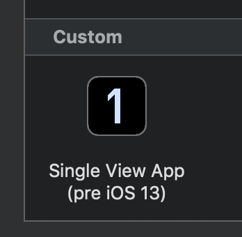

# Xcode Templates

Xcode 11 doesn't include any iOS Project Templates anymore that are compatible with iOS 12 and below.
The `Single View App (pre iOS 13).xctemplate` in this repo fixes that. So far it simples gives you back the old template that works on both iOS 12 (and below), and on iOS 13 but without the new UIScene API.

In an update I want to make this compatible both with iOS 12 and the new iOS 13 UIScene API, using the steps [outlined here](https://stackoverflow.com/questions/57129668/ui-state-restoration-for-a-scene-in-ios-13-while-still-supporting-ios-12-no-sto).

### Installation

1. If it does not yet exist create a `Project Templates/Custom` folder:

        $ mkdir -p ~/Library/Developer/Xcode/Templates/Project\ Templates/Custom

2. Copy `Single View App (pre iOS 13).xctemplate` into that new `Custom` folder:

        $ cp -r "Single View App (pre iOS 13).xctemplate" ~/Library/Developer/Xcode/Templates/Project\ Templates/Custom

3. The new template will now appear in Xcode's project template browser under `Custom` when you create a new project.

### Thanks

Thank you for these fine individuals for sharing their knowledge:
https://github.com/kharrison/Xcode-Templates
https://useyourloaf.com/blog/creating-custom-xcode-project-templates/
https://www.telerik.com/blogs/how-to-create-custom-project-templates-in-xcode-7

